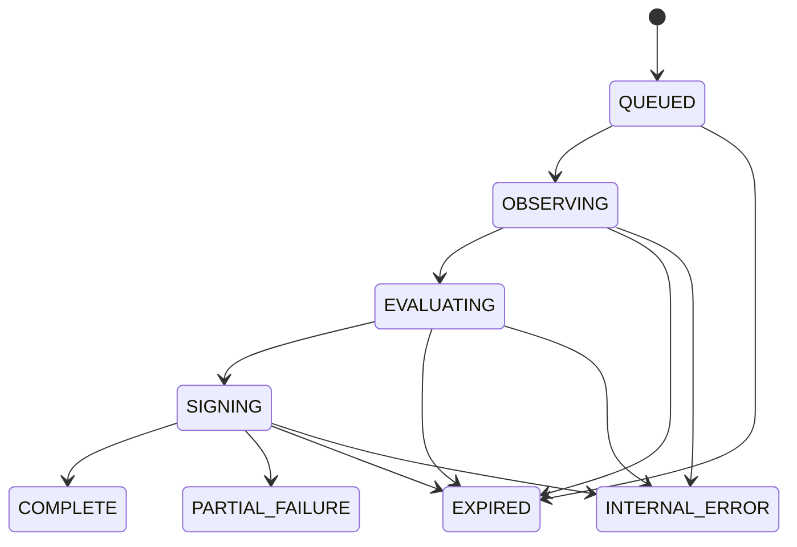

# Durable verification jobs

`POST /v1/jobs` persists work before returning. A separate worker resumes it across process restarts. Production requires PostgreSQL; SQLite remains a development/test backend. `/v1/verify`, `/v1/verify/batch`, and registered synchronous verification keep their existing response shapes and 50-condition contract limit. The new job contract allows 1–1,000 conditions, within the existing request-size limit.

## API

All routes use the workspace's verification key in `X-DoneProof-Key`. Connection administrator keys do not authorize these routes. Missing or foreign job IDs both return 404 after authentication.

| Route | Behavior |
| --- | --- |
| `POST /v1/jobs` | Require `Idempotency-Key`; return 202 and `Location` after the transaction commits. Replays return 200 and the original job. A changed request with the same tenant/key returns 409. |
| `GET /v1/jobs/{id}` | State, revision, counts, timestamps, terminal reason, published receipt ID, and callback delivery status. |
| `GET /v1/jobs/{id}/conditions` | Paginated condition results and attempt history; `offset=0`, `limit=100` by default, maximum 1,000. Internal observations and leases are excluded. |
| `POST /v1/jobs/{id}/cancel` | Atomically terminate active work as `EXPIRED`, reason `cancelled`. Repeating cancellation or cancelling a completed job returns its existing terminal state. |
| `GET /v1/jobs/{id}/wait` | Optional long poll. Return on revision change, terminal state, client disconnect, or timeout. `after_revision=-1`, `timeout=20`; maximum 25 seconds. |
| `GET /v1/receipts/{receipt_id}` | Existing tenant-scoped receipt API, also used for job receipts. |

Submit exactly one `contract` or `registered_contract_id`, plus optional `deadline_seconds` (default 300; 1–3,600) and `callback_id`.

```bash
curl -X POST "$DONEPROOF_URL/v1/jobs" \
  -H "X-DoneProof-Key: $DONEPROOF_KEY" \
  -H 'Idempotency-Key: agent-run-1842-final-check' \
  -H 'Content-Type: application/json' \
  --data '{"registered_contract_id":"cc_registered_run","deadline_seconds":300,"callback_id":"audit"}'
```

For transition assurance, register through `/v1/runs` **before** execution, then pass the returned ID. Jobs freeze the stored contract and baselines. The asynchronous endpoint requires the completed registration audit marker; a submitted contract saved by synchronous verification is insufficient. Submitted job contracts retain `submitted` assurance, and `require_change` remains UNKNOWN without registered baselines. Caller observations, baselines, verdicts, and arbitrary callback URLs are not accepted job fields.

Idempotency is scoped to tenant and the new job API. The request hash uses canonical submitted JSON before generated contract IDs/timestamps, so repeating a body with omitted defaults is safe. Terminal jobs retain their keys; clients should use a new key for a new observation. Each tenant may have at most 1,000 active, unexpired jobs.

## States and receipt semantics



`COMPLETE` means orchestration completed; the signed verdict may be VERIFIED, PARTIAL, FAILED, or UNKNOWN. `PARTIAL_FAILURE` means at least one condition exhausted its infrastructure retry budget; that condition evaluates to UNKNOWN. The existing required/optional condition rules still determine the receipt verdict. `EXPIRED` and `INTERNAL_ERROR` publish no receipt. Cancellation uses `EXPIRED` with reason `cancelled`; it cannot undo an already published receipt.

The engine exposes distinct observation, predicate evaluation, transition evaluation, verdict calculation, and signing operations. Only provider adapters construct observations. Checkpoints retain normalized provider state privately; public records contain evaluated, sanitized evidence. Sensitive-key values are redacted before persistence. A predicate affected by redaction becomes UNKNOWN, including `exists`/`not_exists`; redaction is never treated as evidence of absence. Provider source links drop query strings, fragments and user information. Credentials stay exclusively in the Phase 1 encrypted connection store.

Managed observations carry an internal connection ID/revision. Before publishing, the transaction locks current connection rows and rechecks their state, expiry and revision. A connection changed or disconnected after observation produces UNKNOWN. GitHub public observations remain valid only while there is no managed connection. Existing account-bound transition semantics remain in the adapter.

## Retry and concurrency policy

| Provider | Maximum attempts per condition | Backoff base / cap | Global durable observation slots |
| --- | --- | --- | --- |
| GitHub | 4 | 1s / 60s | 8 |
| Gmail | 4 | 1s / 32s | 4 |
| Trusted webhook evidence | 2 | 0.5s / 5s | 16 |
| Unresolved | 1 | 1s / 1s | 16 |

Backoff doubles with equal jitter between half and all of the capped delay. `Retry-After` seconds and HTTP dates, and GitHub exhausted-rate-limit reset times, take precedence even when longer than the local cap. The worker persists wake times instead of sleeping while holding a provider slot. If the next attempt lies beyond the overall deadline, the job expires.

Only transient 429, retryable 5xx (excluding 501/505), network failures and timeouts are retried. GitHub quota 403 responses and Gmail structured quota reasons have explicit classification. Ordinary permission denial, missing resources, invalid selectors, failed predicates, and indeterminate semantic results are not infrastructure retries. An ambiguous rotating OAuth refresh continues to require reconnection; replaying a refresh to improve apparent job success is unsafe.

The synchronous engine also bounds concurrency within each call. Durable provider slots coordinate all worker processes through PostgreSQL. A slot covers one condition's observation, including its sequential discovery reads. Synchronous calls retain their direct execution path and do not participate in the durable queue's deployment-wide slots; use jobs for production bulk verification.

Provider policy references: [Gmail error handling](https://developers.google.com/workspace/gmail/api/guides/handle-errors), [GitHub rate limits](https://docs.github.com/en/rest/using-the-rest-api/rate-limits-for-the-rest-api).

## Recovery and publication

Workers claim ready jobs and provider slots with PostgreSQL `FOR UPDATE SKIP LOCKED`. Work executes outside database transactions. Leases last at least 90 seconds and exceed the configured per-observation timeout by 60 seconds. Condition attempts, observations, evaluations and the unsigned receipt are durable checkpoints.

Restarted workers reuse completed observations and evaluations. Interrupted attempts consume their original attempt budget. Expired lease owners cannot mutate recovered work or publish receipts. Cancellation is polled during network observation and stops local reads; late results are fenced at the database boundary. Under a hard process crash, expired leases make work eligible again. HTTP timeouts bound normal in-flight reads; process suspension beyond a lease can allow an old read to finish after reassignment, but its result cannot be published.

Receipt ID and unsigned payload are persisted before signing. Signing, receipt insertion, the terminal job state, audit event and callback outbox insertion commit in one transaction. A crash may repeat deterministic signing CPU work, but only one receipt can be durably published for a job. A signer key change between evaluation and publication ends the job with `INTERNAL_ERROR`/`signing_key_changed`; drain pending jobs before rotating the key.

## Completion callbacks

An operator configures `DONEPROOF_JOB_CALLBACKS_JSON` on **both** API and worker:

```json
{"tenant-a":{"audit":{"url":"https://receiver.example.org/doneproof","secret":"replace-with-at-least-32-random-characters"}}}
```

Callers choose `callback_id`, never a URL. The destination must be fixed HTTPS without credentials, a query, a fragment, or a private literal address. These destinations are trusted operator configuration: use dedicated receiver domains, retain control of their DNS, and enforce outbound destination/network policy at deployment. Redirects are never followed. This callback option does not introduce arbitrary-URL verification.

Every terminal state enqueues an event atomically. Payload fields are `event_id`, `job_id`, `state`, `receipt_id` (null without a receipt), and `finished_at`. No contract, observation, credential or receipt body is sent. Headers:

- `X-DoneProof-Event`: stable event ID.
- `X-DoneProof-Timestamp`: Unix delivery-attempt timestamp.
- `X-DoneProof-Signature`: `sha256=` plus hex HMAC-SHA256 of `timestamp + "." + raw_body`, keyed by the callback secret.

Receivers should verify the HMAC with a constant-time comparison, enforce a short timestamp tolerance, and deduplicate by event ID. Delivery is **at least once**, with six attempts, 2s base/300s capped exponential jitter, and a 24-hour deadline; provider `Retry-After` still takes precedence. A crash after remote acceptance may resend the same event. 2xx acknowledges delivery; redirects and other semantic 4xx responses stop delivery. Callback failure does not change an issued receipt. Changed/missing destination configuration marks the old event DEAD instead of retargeting it; secret rotation uses the current secret.

## Deployment, migration and operations

1. Back up production PostgreSQL using the existing operational process. Deploy the additive migration with the API. Migration 3 runs under the existing advisory transaction lock and preserves prior contracts, receipts, signatures, connection ciphertext and idempotency rows byte-for-byte.
2. Run the same image/version on persistent compute with `python -m doneproof.worker`. `docker compose up --build` now includes the worker service. The worker uses the API's PostgreSQL URL, stable signing key, connection encryption keys and OAuth configuration.
3. Vercel can continue hosting the API, but a Vercel request or background task is not a durable worker. Run the worker on a container/process host with network access to PostgreSQL and the approved providers. No worker deployment is performed automatically by this change.
4. Monitor oldest unexpired queued jobs, deadline expirations, INTERNAL_ERROR, exhausted attempts and DEAD callbacks. Terminal reason/error codes are fixed identifiers and safe to aggregate. The container worker does not expose an HTTP server, so Compose disables the API image's inherited HTTP health probe for that service.
5. SIGTERM stops both loops and cancels in-flight reads; the job is eligible for recovery once work has stopped. Hard kills recover after lease expiry. Keep API and workers on matching code and keys, and stop old workers before rolling back application code. Additive tables can remain in place on rollback; do not delete receipts or connector data.

SQLite migrations use `BEGIN IMMEDIATE` and serve local parity tests. PostgreSQL integration tests cover concurrent creation/migration, leases, fencing, cancellation, receipt rollback and tenant foreign keys. The CI PostgreSQL job also runs the synthetic 1/10/100/1,000-condition benchmarks; its `orchestration-benchmarks` artifact contains all samples' summary statistics. See [benchmark methodology and results](../benchmarks/results/README.md).
